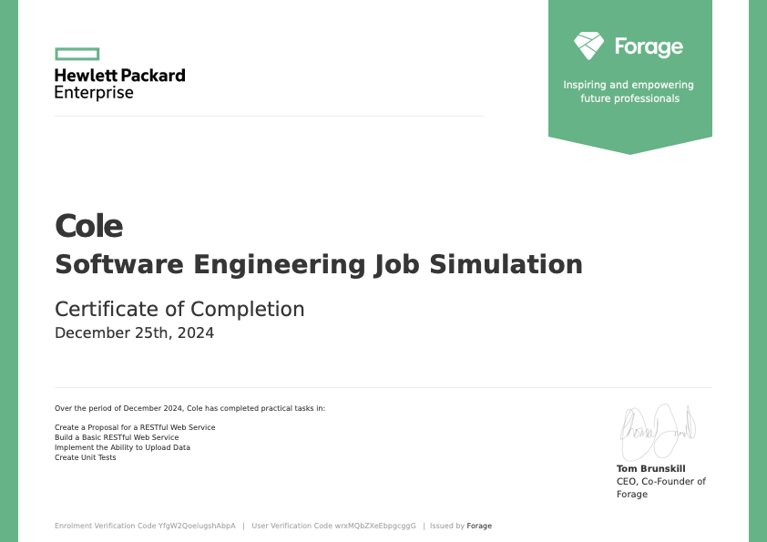

# HPE Software Engineer Training


This repository contains my completed work for Hewlett Packard Software Engineer Training.  
The project focuses on building and testing a **RESTful Employee Management web service** with Java Spring Boot, along with a proposal for deployment on the **HPE GreenLake private cloud platform**.

---

## Table of Contents

- [Overview](#Overview)
- [Certificate](#Certificate)
- [Key Components](#Key-Components)
- [Folder Structure](#Folder-Structure)
- [Tools & Technologies](#Tools--Technologies)
- [Skills Demonstrated](#Skills--Demonstrated)

---

## Overview
During this program, I designed and implemented a **REST API** for managing employee records. The system supports CRUD operations, is backed by unit and integration tests, and includes a professional proposal for deployment to cloud infrastructure.

---

## Certificate



---

## Key Components

### 1. Employee Management REST API
- **Spring Boot Application** implementing a RESTful service.
- Core features:
  - `GET /employees` → retrieve all employees
  - `POST /employees` → add a new employee
  - *(Proposal includes `PUT` and `DELETE` for updates and removals)*
- Data is represented via an `Employee` entity with fields:
  - `employee_id`
  - `first_name`
  - `last_name`
  - `email`
  - `title`

### 2. Service Layer
- `EmployeeManager.java` manages an in-memory list of employees and exposes methods to retrieve and add employees.
- `Employees.java` is a wrapper class for holding a list of `Employee` objects.

### 3. Testing
- Comprehensive **JUnit + MockMvc** tests in `RestServiceApplicationTests.java`:
  - `testGetEmployees()` validates retrieval of employee data.
  - `testAddEmployee()` verifies employee creation with proper HTTP status codes and headers.

### 4. Cloud Deployment Proposal
- **Employee Management RESTful Web Service Proposal.pdf**
- Outlines design for deployment on **HPE GreenLake** with:
  - Persistent storage in a relational database (MySQL/PostgreSQL).
  - Full CRUD support (`GET`, `POST`, `PUT`, `DELETE`).
  - Authentication and security measures.
  - Error handling for `400`, `404`, and `500` cases.

---

## Folder Structure

```bash
.
├── src/main/java/com/example/restservice
│ ├── Employee.java # Employee entity
│ ├── EmployeeController.java # REST API controller
│ ├── EmployeeManager.java # Service for managing employees
│ ├── Employees.java # Employee list wrapper
│ └── RestServiceApplication.java # Spring Boot main entry point
│
├── src/test/java/com/example/restservice
│ └── RestServiceApplicationTests.java # JUnit tests with MockMvc
│
├── Employee Management RESTful Web Service Proposal.pdf
└── README.md
```

---

## Tools & Technologies
- **Java 17**  
- **Spring Boot** (REST API development)  
- **JUnit 5 + Mockito** (testing)  
- **HPE GreenLake (conceptual)** (cloud deployment platform)  

---

## Skills Demonstrated
- RESTful API design and implementation with Spring Boot.  
- Unit and integration testing using JUnit and Mockito.  
- Writing a **cloud deployment proposal** with emphasis on scalability, security, and persistence.  
- Applying software engineering best practices in a real-world simulation context.  
